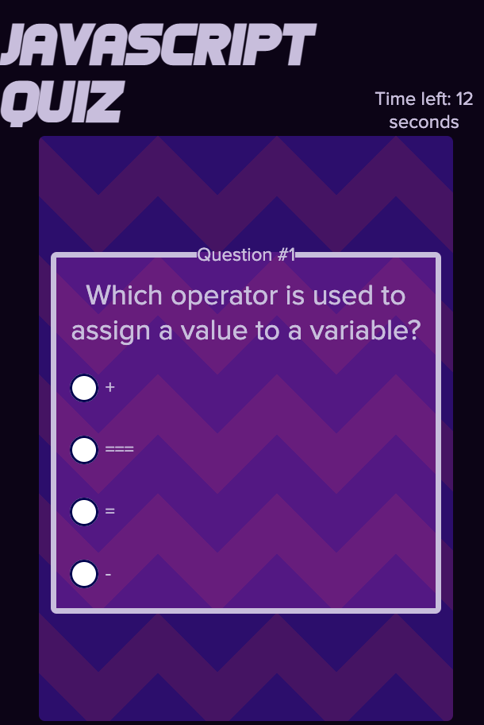

/*module_4_web_apis_code_quiz*/
# Module 4 Challenge: Web APIs Code Quiz

## User Story
AS A coding boot camp student 
I WANT to take a timed quiz on JavaScript fundamentals that stores high scores 
SO THAT I can gauge my progress compared to my peers 

## Features
I built this project from the ground up, implemented more event listeners than my password generator and utilized local storage for the first time. The quiz game runs after the user clicks on the start button and goes through a series of questions with change events. If the user answers incorrectly, the timer will deduct 10 seconds. After the last question, the quiz ends and if the user has at least one correct answer, they will be allowed to record their score on the score board.

## Mock-up

 
Deployed Project: https://robobrownie13.github.io/module_4_web_apis_code_quiz/